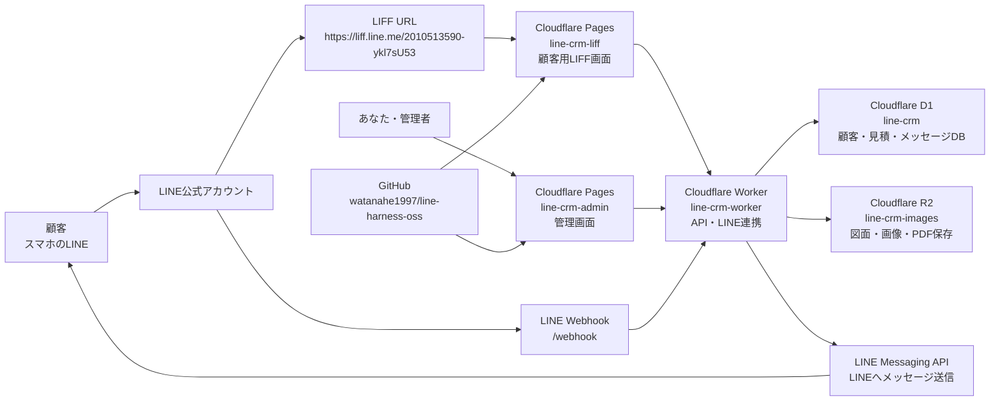
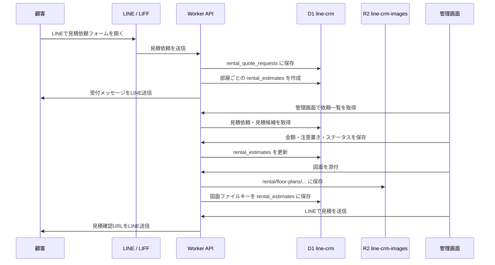
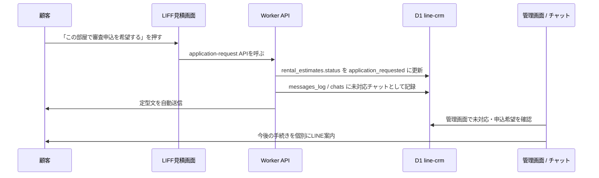
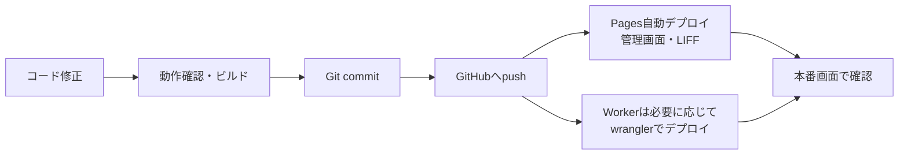

# 賃貸の神 システムアーキテクチャ整理

作成日: 2026-06-28  
対象: LINEでの見積依頼、管理画面での見積作成、LINEへの見積送信、顧客の審査申込希望通知まで

## 1. まず全体像

このシステムは、ざっくり言うと次の5つで動いています。

| 役割 | 使っているもの | 何をしているか |
|---|---|---|
| 顧客の入口 | LINE公式アカウント / LIFF | 顧客がLINE内で見積依頼フォームや見積画面を開く |
| 顧客用画面 | Cloudflare Pages: `line-crm-liff` | 見積依頼フォーム、見積確認画面、審査申込希望ボタンを表示する |
| 管理画面 | Cloudflare Pages: `line-crm-admin` | 管理者が見積作成、図面添付、LINE送信、審査申込希望の確認をする |
| API・LINE連携 | Cloudflare Worker: `line-crm-worker` | データ保存、LINE送信、Webhook受信、本人確認を行う |
| データ保存 | Cloudflare D1 / R2 | D1に文字データ、R2に画像・PDFなどのファイルを保存する |

全体の図はこれです。



## 2. 本番で使っているURL・リソース

| 種類 | 名前 | URL / 補足 |
|---|---|---|
| Worker API | `line-crm-worker` | `https://line-crm-worker.watanahe1997.workers.dev` |
| 管理画面 Pages | `line-crm-admin` | `https://line-crm-admin-2hn.pages.dev` |
| 顧客用 LIFF Pages | `line-crm-liff` | `https://line-crm-liff-94h.pages.dev` |
| LIFF URL | LIFF ID `2010513590-ykl7sU53` | `https://liff.line.me/2010513590-ykl7sU53` |
| LINE Login Endpoint URL | LIFF Pages | `https://line-crm-liff-94h.pages.dev` |
| LINE Webhook URL | Worker | `https://line-crm-worker.watanahe1997.workers.dev/webhook` |
| D1データベース | `line-crm` | 文字データを保存 |
| R2バケット | `line-crm-images` | 図面・画像・PDFを保存 |
| GitHub | `watanahe1997/line-harness-oss` | ソースコードの保管場所 |

## 3. 顧客と管理者の業務フロー

### 3.1 見積依頼から見積送信まで



### 3.2 顧客が審査申込希望を押した後



この時点では、審査申込を完全自動化していません。  
管理会社ごとに必要書類や申込方法が違うため、顧客が希望ボタンを押した後は、あなたが個別に案内する運用です。

## 4. どこに何を保存しているか

### 4.1 文字データはD1に保存

D1データベース名: `line-crm`

主に見るべきテーブルはこれです。

| テーブル | 保存しているもの | 運用上の意味 |
|---|---|---|
| `friends` | LINE友だち情報、LINE userId、表示名など | 顧客のLINE上の本人情報 |
| `line_accounts` | LINE公式アカウントごとの設定 | 複数LINEアカウントを使う場合の管理 |
| `messages_log` | 送受信したLINEメッセージ履歴 | 「誰に何を送ったか」の履歴 |
| `chats` | 個別対応が必要な会話状態 | 未対応チャットの管理 |
| `tags` / `friend_tags` | 顧客タグ | 見積依頼済み、審査申込希望などの状態管理 |
| `rental_quote_requests` | 顧客からの見積依頼本体 | 物件URL、入居希望日、ペット有無など |
| `rental_estimates` | 部屋ごとの見積 | 家賃、礼金、鍵交換費、図面ファイルキーなど |
| `rental_applications` | 本申込情報の保存用 | 現在は原則使わず、将来の本申込フォーム用 |
| `rental_audit_logs` | 操作履歴 | 誰が保存・送信・ファイル閲覧したかの記録 |
| `rental_settings` | 賃貸機能の設定 | 本人確認書類アップロードON/OFF、保持期限など |
| `admin_users` / `staff_members` | 管理画面ユーザー | owner / admin / staff の権限管理 |

注意点:

- D1は「台帳」です。顧客情報、見積金額、ステータス、メッセージ履歴などの文字データはここに入ります。
- 図面そのものの画像・PDFはD1には入りません。D1には「R2のどのファイルを見るか」というキーだけ保存されます。

### 4.2 ファイルはR2に保存

R2バケット名: `line-crm-images`

| ファイル種別 | R2内の保存パス | D1側で持つキー |
|---|---|---|
| 図面PDF / 図面画像 | `rental/floor-plans/{estimateId}/{uuid}.{拡張子}` | `rental_estimates.floor_plan_key` |
| 本人確認書類 | `rental/identity/{applicationId}/{uuid}.{拡張子}` | `rental_applications.identity_file_key` |
| リッチメニュー画像など | 機能ごとのキー | `rich_menu_pages.imageR2Key` など |

重要:

- R2のファイルは公開URLにしていません。
- 顧客が図面を見る時も、管理者が図面を見る時も、必ずWorkerを通します。
- Workerが「この人に見せてよいか」を確認してから、R2のファイルを返します。

### 4.3 秘密情報はCloudflareのSecretsに保存

GitHubやコード内に直接書かない情報です。

Workerの主なSecrets:

| 名前 | 役割 |
|---|---|
| `API_KEY` | APIキー認証用 |
| `LINE_CHANNEL_ACCESS_TOKEN` | LINEにメッセージを送るためのトークン |
| `LINE_CHANNEL_SECRET` | LINE Webhookの署名検証 |
| `LINE_LOGIN_CHANNEL_SECRET` | LINE Login / LIFF本人確認 |

環境変数として使う主な値:

| 名前 | 現在の値・意味 |
|---|---|
| `WORKER_URL` | `https://line-crm-worker.watanahe1997.workers.dev` |
| `LIFF_URL` | `https://liff.line.me/2010513590-ykl7sU53` |
| `ADMIN_ORIGIN` | `https://line-crm-admin-2hn.pages.dev,https://line-crm-liff-94h.pages.dev` |
| `ADMIN_ALLOW_CROSS_SITE` | `true` |
| `NEXT_PUBLIC_API_URL` | 管理画面Pagesが参照するWorker URL |
| `VITE_API_BASE` | LIFF Pagesが参照するWorker URL |
| `VITE_DEFAULT_LIFF_ID` | `2010513590-ykl7sU53` |

## 5. どのコードが何を担当しているか

| 場所 | 役割 |
|---|---|
| `apps/worker` | API本体。LINE送信、Webhook受信、D1/R2読み書き |
| `apps/worker/src/routes/rental.ts` | 賃貸見積・審査申込希望・図面アップロードのAPI |
| `apps/worker/src/routes/webhook.ts` | LINE友だち追加、顧客メッセージ、自動返信 |
| `apps/worker/src/services/rental.ts` | 見積金額計算、定型文、入力チェック |
| `apps/worker/src/services/liff-auth.ts` | LIFFから来た顧客本人のLINE ID確認 |
| `apps/web` | 管理画面。あなたがPCで使う画面 |
| `apps/web/src/app/rental/page.tsx` | 見積・審査申込の管理画面 |
| `apps/web/src/lib/api.ts` | 管理画面からWorker APIを呼ぶ共通処理 |
| `apps/liff` | 顧客がLINE内で見る画面 |
| `apps/liff/src/pages/RentalQuoteRequest.tsx` | 見積依頼フォーム |
| `apps/liff/src/pages/RentalEstimates.tsx` | 顧客向け見積一覧・図面プレビュー |
| `apps/liff/src/pages/RentalApplicationConfirm.tsx` | 審査申込希望の確認画面 |
| `apps/liff/src/lib/rental-api.ts` | LIFFからWorker APIを呼ぶ共通処理 |
| `packages/db` | D1テーブル操作、DB型、マイグレーション |
| `packages/db/migrations/046_rental_brokerage.sql` | 賃貸見積機能のDB定義 |
| `packages/line-sdk` | LINE APIを呼ぶための共通処理 |
| `packages/shared` | 管理画面・Workerで共有する型や小道具 |

## 6. LINE Developers側の設定

### 6.1 Messaging APIチャネル

主な設定:

| 項目 | 設定値 |
|---|---|
| Webhook URL | `https://line-crm-worker.watanahe1997.workers.dev/webhook` |
| Webhookの利用 | ON |
| 応答メッセージ | OFF |
| あいさつメッセージ | 必要なければOFF |

このシステムでは、顧客がメッセージを送った時の返答はWorker側で制御します。  
LINE公式アカウント側の「応答メッセージ」をONにすると、LINE側の定型文とWorker側の返信がぶつかる可能性があります。

### 6.2 LINE Loginチャネル / LIFF

主な設定:

| 項目 | 設定値 |
|---|---|
| LIFF Endpoint URL | `https://line-crm-liff-94h.pages.dev` |
| LIFF ID | `2010513590-ykl7sU53` |
| LIFF URL | `https://liff.line.me/2010513590-ykl7sU53` |
| Scope | 原則 `openid` のみ |
| チャネル状態 | 公開済みにする |

`openid` は、見積を見ている人が本当にそのLINEユーザー本人か確認するために必要です。  
`profile` や `email` は、現在の見積依頼フォームでは不要です。

## 7. Cloudflare側の設定

### 7.1 Worker

Worker名: `line-crm-worker`

Workerが担当すること:

- 管理画面API
- 顧客LIFF API
- LINE Webhook
- LINEへのpush/reply送信
- D1への保存
- R2へのファイル保存・取り出し
- 定期実行、配信キュー、リマインダーなど

必要なBinding:

| Binding | 接続先 |
|---|---|
| `DB` | D1 `line-crm` |
| `IMAGES` | R2 `line-crm-images` |

### 7.2 Pages: 管理画面

Project名: `line-crm-admin`

必要な環境変数:

```env
NEXT_PUBLIC_API_URL=https://line-crm-worker.watanahe1997.workers.dev
```

### 7.3 Pages: LIFF

Project名: `line-crm-liff`

必要な環境変数:

```env
VITE_API_BASE=https://line-crm-worker.watanahe1997.workers.dev
VITE_DEFAULT_LIFF_ID=2010513590-ykl7sU53
```

## 8. 日々の運用方法

### 8.1 毎日見る場所

1. 管理画面を開く  
   `https://line-crm-admin-2hn.pages.dev`

2. 「見積・審査申込」を確認する

3. 新しい見積依頼があれば、部屋ごとに以下を入力する
   - 家賃
   - 共益費・管理費
   - 敷金
   - 礼金
   - 前家賃
   - 火災保険
   - 保証会社費用
   - 鍵交換費
   - クリーニング費
   - 仲介手数料
   - キャッシュバック
   - 顧客向け注意書き

4. 図面があれば添付する

5. 「LINEで見積を送信」を押す

6. 顧客が「この部屋で審査申込を希望する」を押したら、管理画面またはチャット欄で確認し、個別に案内する

### 8.2 顧客からメッセージが来た時

現在の方針:

- 審査申込希望を押す前の個別問い合わせは、定型文で自動回答する
- 審査申込希望を押した後は、個別対応に切り替える

つまり、顧客対応の本番開始点は「この部屋で審査申込を希望する」を押した後です。

## 9. 保守・更新の基本ルール

### 9.1 コード変更の流れ



基本コマンド:

```powershell
git status
pnpm --filter worker typecheck
pnpm --filter worker build
pnpm --filter liff build
$env:NEXT_PUBLIC_API_URL='https://line-crm-worker.watanahe1997.workers.dev'; pnpm --filter web build
git add .
git commit -m "変更内容を短く書く"
git push
```

Workerを手動デプロイする場合:

```powershell
pnpm --filter worker build
npx -y wrangler deploy "dist\line_harness\index.js" `
  --config "dist\line_crm_worker\wrangler.json" `
  --assets "dist\client" `
  --keep-vars `
  --var ADMIN_PUBLIC_URL:https://line-crm-admin-2hn.pages.dev `
  --var ADMIN_ORIGIN:https://line-crm-admin-2hn.pages.dev,https://line-crm-liff-94h.pages.dev `
  --var ADMIN_ALLOW_CROSS_SITE:true
```

Workerデプロイは、管理画面やLIFFより少し間違えやすいです。  
迷ったら、手入力せずCodexに「Workerを本番デプロイして」と依頼する運用が安全です。

LIFF Pagesを手動デプロイする場合:

```powershell
$env:VITE_API_BASE='https://line-crm-worker.watanahe1997.workers.dev'
$env:VITE_DEFAULT_LIFF_ID='2010513590-ykl7sU53'
pnpm --filter liff build
npx wrangler pages deploy apps\liff\dist --project-name line-crm-liff --branch main --commit-dirty=true
```

管理画面Pagesを手動デプロイする場合:

```powershell
$env:NEXT_PUBLIC_API_URL='https://line-crm-worker.watanahe1997.workers.dev'
pnpm --filter web build
npx wrangler pages deploy apps\web\out --project-name line-crm-admin --branch main --commit-dirty=true
```

### 9.2 DB変更のルール

DBの構造を変える時は、必ず `packages/db/migrations` にSQLを追加します。  
直接D1を手で書き換えると、後から「何を変えたか」が分からなくなるので避けます。

本番DBにSQLを適用する例:

```powershell
npx wrangler d1 execute line-crm --remote --file=packages/db/migrations/XXX_name.sql
```

### 9.3 バックアップ

D1は定期的にSQLとしてバックアップします。

例:

```powershell
npx wrangler d1 export line-crm --remote --output backups\line-crm-2026-06-28.sql
```

おすすめ頻度:

- 本番運用開始前: 必ず1回
- 大きな修正前: 必ず1回
- 通常運用: 週1回

R2の図面・画像は、Cloudflare Dashboard上でバケット `line-crm-images` を確認します。  
重要な契約前後のデータは、必要に応じて別途ローカルやクラウドストレージにも控えを持つ運用にすると安全です。

## 10. よくあるトラブルと見る場所

| 症状 | まず見る場所 | よくある原因 |
|---|---|---|
| 管理画面で保存できない | Worker環境変数 `ADMIN_ORIGIN` | 管理画面URLが許可リストに入っていない |
| 管理画面でログインできない | `ADMIN_ALLOW_CROSS_SITE` / Cookie設定 | PagesとWorkerが別ドメインなのでCookie設定が必要 |
| LIFFで `Load failed` | Pages環境変数 `VITE_API_BASE` | LIFFが古いWorker URLを見ている |
| LINEで見積が送れない | LINE token / Worker logs | アクセストークン、友だち状態、見積金額未保存 |
| 図面が表示されない | R2 `line-crm-images` / `floor_plan_key` | R2保存失敗、MIMEタイプ、認証エラー |
| 別アカウントでLIFFが開けない | LINE Loginチャネル状態 | 開発中ステータス、スコープ、LIFF公開状態 |
| 余計な自動返信が来る | LINE公式アカウント設定 | 応答メッセージ・あいさつメッセージがON |
| 審査申込希望後に通知が見えない | `messages_log` / `chats` | チャット未対応表示、ステータス同期、Webhook処理 |

## 11. セキュリティ上の考え方

このシステムで特に守るべきものは次の3つです。

1. 顧客のLINE userId
2. 見積依頼内容
3. 図面・本人確認書類などのファイル

守り方:

- 顧客LIFFはLINEの `id_token` で本人確認する
- 管理画面はログインCookieとCSRFトークンで守る
- 図面・本人確認書類は公開URLにしない
- R2ファイルはWorker経由でのみ返す
- `API_KEY` やLINEトークンはGitHubに書かない
- 本人確認書類アップロードは必要になるまでOFFにしておく
- 個人情報を含むLINE文面は自動送信しない

## 12. 今後の拡張候補

ゴールから外れない範囲で、次に現実的なのはこの順番です。

1. 管理画面で「審査申込希望」だけを見やすくする
2. 申込希望が来たら管理者に分かりやすく通知する
3. 申込希望者に送る個別案内テンプレートを管理画面から選べるようにする
4. 管理会社ごとの申込URL・必要書類メモを物件ごとに保存する
5. 本申込フォームや本人確認書類アップロードは、運用が固まってからONにする

現時点では「顧客が見積依頼 → あなたが見積作成 → 顧客が申込希望 → あなたが個別対応」が一番安全で現実的です。
